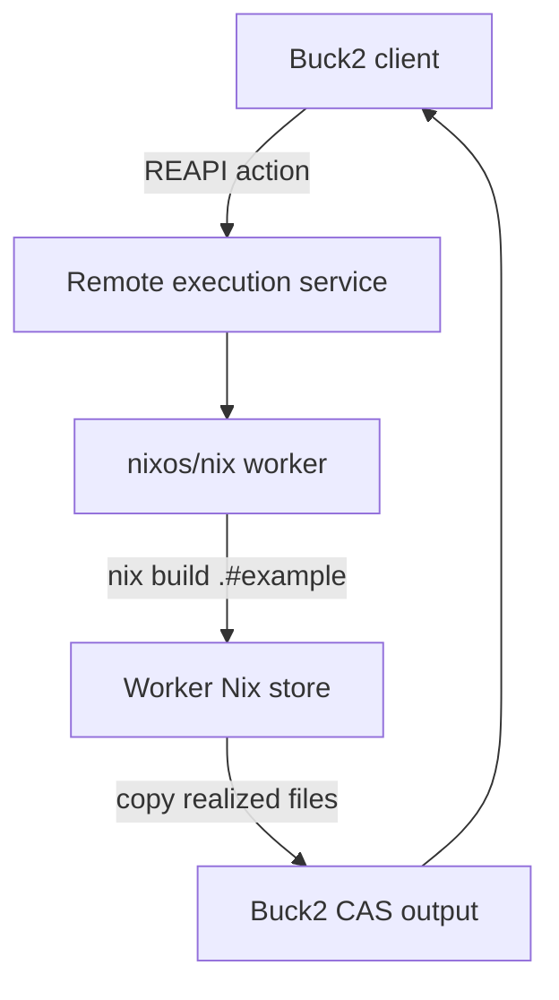

# Buck2, Nix, and remote execution

`//:example` is a Buck2 action whose command runs Nix inside an official
`nixos/nix` worker image. This is intentionally different from importing a
locally realized Nix package into Buck2: the remote worker performs the Nix
evaluation and build.

## Architecture



## RE service configuration

The checked-in `.buckconfig` points to BuildBuddy Cloud and reads its API key
from `BUILDBUDDY_API_KEY`. The key is deliberately not stored in the project.
`.buckconfig.local.example` can override the endpoint for BuildBarn or another
REAPI implementation.

Buck2 sends these execution properties:

```text
OSFamily=linux
container-image=docker://nixos/nix:2.35.2-amd64@sha256:617d914dba5384bf75adf17081583b69371031ec7defce36c34c5fa14fc819b0
```

BuildBarn deployments generally register a worker with matching properties.
Services with dynamic container support may pull the image based on the
property.

## Security and reproducibility boundary

The image disables Nix's nested sandbox because typical OCI-backed RE workers
do not grant the privileges required to create another sandbox. Buck2's remote
action container remains the outer isolation boundary. Flake inputs are pinned
by `flake.lock`; once that file exists, changing an input changes the action
digest and Nix derivation.

For an offline production worker, mirror the flake inputs and binary cache
inside the execution environment. Allowing arbitrary network access is useful
for this proof of concept but is not the desired final deployment.
